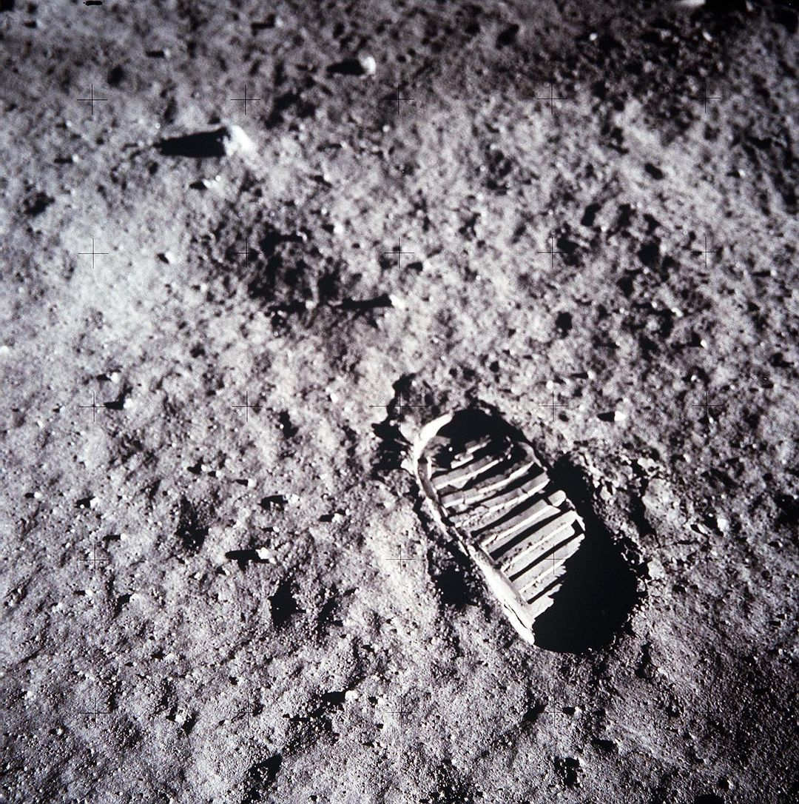

# Paper-Review
## Areas : Vision , Language, Graph 
### by SHIN Joong Hyun 

# 1. Vision Model

Bengio, Yoshua, Ian J. Goodfellow, and Aaron Courville. "**Deep learning**." An MIT Press book. (2015). [[html]](https://www.deeplearningbook.org/) **(Deep Learning Bible, you can read this book while reading following papers.)** :star::star::star::star::star:

## Survey

**[1-0]** LeCun, Yann, Yoshua Bengio, and Geoffrey Hinton. "**Deep learning**." Nature 521.7553 (2015): 436-444. [[pdf]](http://www.cs.toronto.edu/~hinton/absps/NatureDeepReview.pdf) **(Three Giants' Survey)** :star::star::star::star::star:

## papers

**[1-1]**  **"ViT : An Image is Worth 16x16 Words: Transformers for Image Recognition at Scale"**:star::star::star::star::star:
**[paper](https://arxiv.org/abs/2010.11929)**
**[github](https://github.com/google-research/vision_transformer)**  

**[review](https://github.com/Blackeyes0u0/Blackeyes0u0-paper-review/blob/master/papers/Vision/ViT/Vit.md)**

**[1-2]**  **"CLIP : Learning Transferable Visual Models From Natural Language Supervision"**:star::star::star::star::star:
**[paper](https://arxiv.org/abs/2103.00020)**
**[github](https://github.com/openai/CLIP)**  

**[review](https://github.com/Blackeyes0u0/Blackeyes0u0-paper-review/blob/master/papers/Vision/CLIP/clip.md)**

**[1-3]**  **"Deep Residual Learning for Image Recognition"**:star::star::star::star::star:
**[paper](https://arxiv.org/abs/1512.03385)**
**[github](https://paperswithcode.com/)**  

**[review](https://github.com/Blackeyes0u0/Blackeyes0u0-paper-review/blob/master/papers/Vision/resnet/Resnet.pdf)**

**[1-4]**  **"MobileNets: Efficient Convolutional Neural Networks for Mobile Vision Applications"**:star::star::star::star:
**[paper](https://arxiv.org/abs/1704.04861)**
**[github](https://github.com/tensorflow/tensorflow/blob/v2.4.1/tensorflow/python/keras/applications/mobilenet.py)**  

**[review](https://github.com/Blackeyes0u0/Blackeyes0u0-paper-review/blob/master/papers/Vision/mobilenet/mobile.pdf)**

**[1-5]**  **"GhostNet: More Features from Cheap Operations"**:star::star::star:
**[paper](https://arxiv.org/abs/1911.11907)**
**[github](https://github.com/huawei-noah/Efficient-AI-Backbones)**  

**[review](https://github.com/Blackeyes0u0/Blackeyes0u0-paper-review/blob/master/papers/Vision/ghostnet/ghost.pdf)**

<!-- 
**[1-6]**  **"title"**:star::star::star:
**[paper](site)**
**[github](site)**  

**[review](https://github.com/Blackeyes0u0/Blackeyes0u0-paper-review/blob/master/papers/Vision)** -->

------------------------------------------------

# 2. Language Model

## Survey

**[2-0]**  "**A Survey of Large Language Models**."(2023). [[LLM survey paper]](https://arxiv.org/abs/2303.18223) :star::star::star::star:

## papers

**[2-1]**  **"RoFormer: Enhanced Transformer with Rotary Position Embedding"**:star::star::star:
**[paper](https://arxiv.org/abs/2104.09864)**
**[github](https://github.com/lucidrains/performer-pytorch)**  

**[review](https://github.com/Blackeyes0u0/Blackeyes0u0-paper-review/blob/master/papers/Language/)**

**[2-2]**  **"SimCSE: Simple Contrastive Learning of Sentence Embeddings"**:star::star::star::star::star:
**[paper](https://arxiv.org/abs/2104.08821)**
**[github](https://github.com/princeton-nlp/SimCSE)**  

**[review](https://github.com/Blackeyes0u0/Blackeyes0u0-paper-review/blob/master/papers/Language/simCSE/simcse.md)**

<!-- 
**[2-1]**  **"title"**:star::star::star::star::star:
**[paper](site)**
**[github](site)**  

**[review](https://github.com/Blackeyes0u0/Blackeyes0u0-paper-review/blob/master/papers/Language/)** -->

<!-- 
**[2-1]**  **"title"**:star::star::star::star::star:
**[paper](site)**
**[github](site)**  

**[review](https://github.com/Blackeyes0u0/Blackeyes0u0-paper-review/blob/master/papers/Language/)** -->

------------------------------------------------

# 3. Graph Model

<!-- 
## 3.1 Survey

**[3-0]** LeCun, Yann, Yoshua Bengio, and Geoffrey Hinton. "**Deep learning**." Nature 521.7553 (2015): 436-444. [[pdf]](http://www.cs.toronto.edu/~hinton/absps/NatureDeepReview.pdf) **(Three Giants' Survey)** :star::star::star::star::star: -->

## papers

**[3-1]**  **"title"**:star::star::star::star::star:
**[paper](site)**
**[github](site)** 

**[review](https://github.com/Blackeyes0u0/Blackeyes0u0-paper-review/blob/master/papers/Graph/)**

<!-- **[3-1]**  **"title"**:star::star::star::star::star:
**[paper](site)**
**[github](site)** 

**[review](https://github.com/Blackeyes0u0/Blackeyes0u0-paper-review/blob/master/papers/Graph/)**
 -->

---

<!--

- [2012 Alex Net](https://dl.acm.org/doi/abs/10.1145/3065386)
    >[Review](https://github.com/Blackeyes0u0/Blackeyes0u0-paper-review/blob/master/papers/Alexnet.md)
     
    This paper was a breakthrough in the field of computer vision and was the winner of the ImageNet Large Scale Visual Recognition Challenge in 2012.
     
     
    AlexNet consists of eight layers, including five convolutional layers and three fully connected layers. It uses the Rectified Linear Unit (ReLU) activation function and employs techniques such as data augmentation, dropout regularization, and overlapping pooling to prevent overfitting.
     
     
    The network takes an input image of size 227x227 and produces a vector of probabilities for 1000 different classes. The architecture was significant because it demonstrated that deep convolutional neural networks could achieve state-of-the-art performance on large-scale image classification tasks.
    

- [VGG](https://arxiv.org/abs/1409.1556)
  >[VGG Review](https://github.com/Blackeyes0u0/Blackeyes0u0-paper-review/blob/master/papers/VGG.md)
   
  3x3 

- [Inception]()
  >[Inception Review]()
   

v
let's gogogoasdfsf

  Google Net에서 이 모델이 다른 커널 크기(1x1, 3x3, 5x5)를 사용하는 이유는 무엇입니까?
GoogleNet(Inception v1) 아키텍처는 여러 가지 이유로 시작 모듈에서 다양한 커널 크기(1x1, 3x3, 5x5)의 조합을 사용합니다.

다양한 규모에서 기능 캡처: 다양한 크기의 커널을 사용하면 모델이 다양한 규모에서 기능을 캡처할 수 있습니다. 1x1과 같은 더 작은 커널은 로컬 기능을 캡처하는 데 사용되는 반면 5x5와 같은 더 큰 커널은 더 많은 전역 기능을 캡처합니다. 이를 통해 모델은 다양한 규모에서 광범위한 기능을 감지할 수 있습니다.

효율적인 계산 사용: 커널 크기의 조합을 사용하면 모델이 계산 리소스를 효율적으로 사용할 수 있습니다. 더 큰 커널은 더 작은 커널보다 계산 비용이 더 많이 듭니다. 모델은 커널 크기의 조합을 사용하여 다양한 유형의 기능을 캡처하는 데 필요한 계산량의 균형을 맞출 수 있습니다.

매개변수 수 줄이기: 더 큰 커널 사이에 1x1 커널을 사용하면 모델에서 필요한 매개변수 수를 줄일 수 있습니다. 1x1 커널은 더 큰 커널을 적용하기 전에 입력 텐서의 깊이를 줄이는 데 사용됩니다. 이렇게 하면 필요한 매개변수 수를 줄이는 동시에 모델이 다양한 기능을 캡처할 수 있습니다.

전반적으로 GoogleNet 아키텍처의 시작 모듈에서 서로 다른 커널 크기의 조합을 사용하면 모델이 필요한 매개변수 수를 줄이면서 다양한 기능을 효율적으로 캡처할 수 있습니다.

-->
<!--
- [ViT](https://arxiv.org/abs/2010.11929)
  >[Review](https://github.com/Blackeyes0u0/Blackeyes0u0-paper-review/blob/master/papers/ViT.md)
   
  The ViT architecture consists of a stack of Transformer layers, where the input image is divided into patches, which are then flattened and fed into the Transformer layers. The ViT also employs a technique called positional encoding to provide the model with information about the spatial relationships between the patches.

- [Incremental Learning](https://www.nature.com/articles/s42256-022-00568-3)
  >[Incremental Learning](https://github.com/Blackeyes0u0/Blackeyes0u0-paper-review/blob/master/papers/incremental%20learning.md)

- [MLP-Mixer](https://proceedings.neurips.cc/paper/2021/hash/cba0a4ee5ccd02fda0fe3f9a3e7b89fe-Abstract.html)
- 
  >[MLP-Mixer Review](https://github.com/Blackeyes0u0/Blackeyes0u0-paper-review/blob/master/papers/MLP-Mixer.md)

- [Attention Is All You Need](https://proceedings.neurips.cc/paper_files/paper/2017/hash/3f5ee243547dee91fbd053c1c4a845aa-Abstract.html)
  >[Review](https://github.com/Blackeyes0u0/Blackeyes0u0-paper-review/blob/master/papers/transformer.md)

## **List to read**

- [2016 Learning Deep Features for Discriminative Localization](https://openaccess.thecvf.com/content_cvpr_2016/html/Zhou_Learning_Deep_Features_CVPR_2016_paper.html)
  >[Review]()
   
  about Class Activation Map(CAM)

- [2017 Grad-CAM: Visual Explanations from Deep Networks via Gradient-based Localization](https://openaccess.thecvf.com/content_iccv_2017/html/Selvaraju_Grad-CAM_Visual_Explanations_ICCV_2017_paper.html)
  >[Review]()
   
  about Grad-CAM

- [Deep Visual-Semantic Alignments for Generating Image Descriptions](https://www.cv-foundation.org/openaccess/content_cvpr_2015/html/Karpathy_Deep_Visual-Semantic_Alignments_2015_CVPR_paper.html)

- [Show, Attend and Tell: Neural Image Caption Generation with Visual Attention](https://proceedings.mlr.press/v37/xuc15.html)

- [Forward-Forward Algorithm](https://arxiv.org/abs/2212.13345)

<!--
git reset --hard ORIG_HEAD
 -->

<!--

-->

>##### "One small step for a man, one giant leap for mankind" 
>  -Neil Armstrong- 

<!--

-->