#### [ 논문리뷰 ]
### "LoRA: Low-Rank Adaptation of Large Language Models"

# [LoRA](https://arxiv.org/abs/2106.09685)
-Microsoft Corporation-

2023.10.12
##### 발표자 신중현

---
# situation

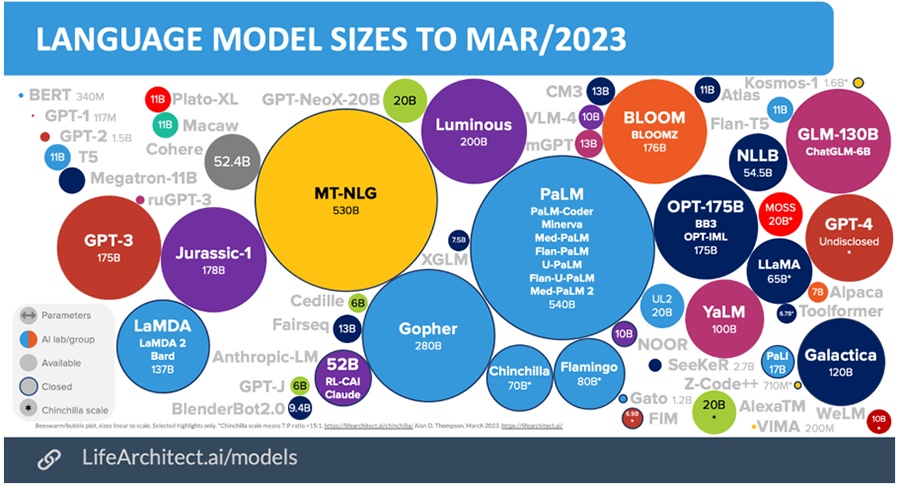

---
# motivation

pretrained model - 다양한 downstream task adaptation

규모를 키운 pretrained 모델의 성능이 경험적으로, 성능적으로 확인된 가운데, 이 모델들을 활용해서 downstream task에 adaptation해서 여러문제를 풀겠다.
-ex) summarization, reading comprehension,


---
### finetuning 

이러한 down stream task들은 training data of context-target pairs 로 표현
$Z = {(x_i,y_i)}_{i=1,...,N}$

---
### fully finetuning

많은 language model의 objective function을 보면,
Maximum likelihood estimation MLE로 푼다.


$$
\max _{\Phi} \sum_{(x, y) \in \mathcal{Z}} \sum_{t=1}^{|y|} \log \left(P_{\Phi}\left(y_t \mid x, y_{<t}\right)\right)
$$

이런 문제를 Backward propagation을 통해서 parameters를 업데이트를 하면서 풉니다.

근데 이럴때, optimizer가 사용되는데, 어떻게 gradient 값들이 지정될까요?

---

##### SGD

SGD는 각 배치(데이터 샘플의 작은 그룹)마다 모델 가중치를 업데이트합니다. 가중치(W)를 업데이트하기 위한 수식은 다음과 같습니다:
Wt+1=Wt−η∇L(Wt)
여기서,Wt는 현재 가중치,Wt+1는 업데이트된 가중치,
 
- η는 학습률(learning rate).
 
- ∇L(Wt)는 비용 함수 L에 대한 그래디언트(gradient)입니다. 

---
##### ADAM
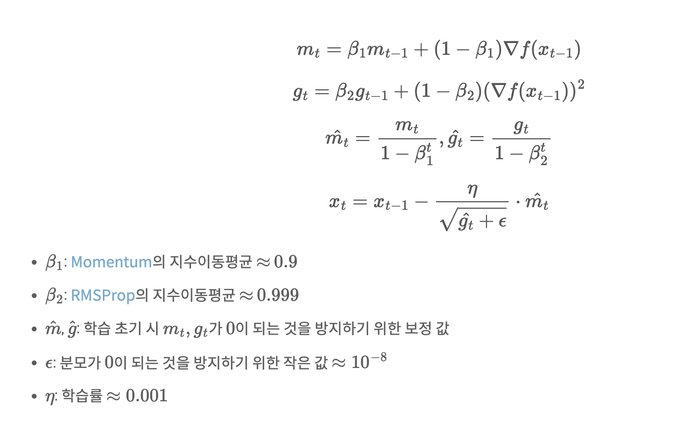

---
 optimizer | VRAM 사용량 |
|---|---|
| SGD | 가중치의 크기 |
| Adam | 가중치의 크기 + m + g |


---
## Insipration
<!-- backgroundImage -->
over-parameterized model이 실제로 낮은 low intrinsic dimension에 있다. 가정.

[Measuring the Intrinsic Dimension of Objective Landscapes](https://arxiv.org/abs/1804.08838) 

[Intrinsic Dimensionality Explains the Effectiveness of Language Model Fine-Tuning Aghajanyan](https://arxiv.org/abs/2012.13255)

---

LoRA: Low-Rank Adaptation
LoRA를 사용하면?

Pre-trained weight를 고정된 상태(freeze)로 유지하면서 Adaptation 중 dense layer의 변화에 대한 rank decomposition matrices를 최적화
이를 통해 신경망의 일부 dense layer를 간접적으로 훈련시키는 것이 가능

- LoRA는 trainable parameter의 수가 적고 학습 처리량이 높으며 inference latency가 이전 연구 대비 적음
- 그럼에도 불구하고 ROBERTa, DeBERTa, GPT-2, GPT-3에서 fine-tuning보다 같거나 더 나은 성능 을 보여줌

---
### Terminologies and Conventions

$d_{model}$ : input/output dimension size 768, 1024

$W_q, W_k, W_v, Wo$ : query/key/value/output projection matrices in self-attention module

$W, W_o$: pre-trained weight matrix
$\Delta W$: accumulated gradient update during adaptation


$r$ : rank of a LORA module
Transformers 논문의 setting을 따름
e.g., use Adam optimizer
= 4x dmodel

---
#### Basic fintuning method

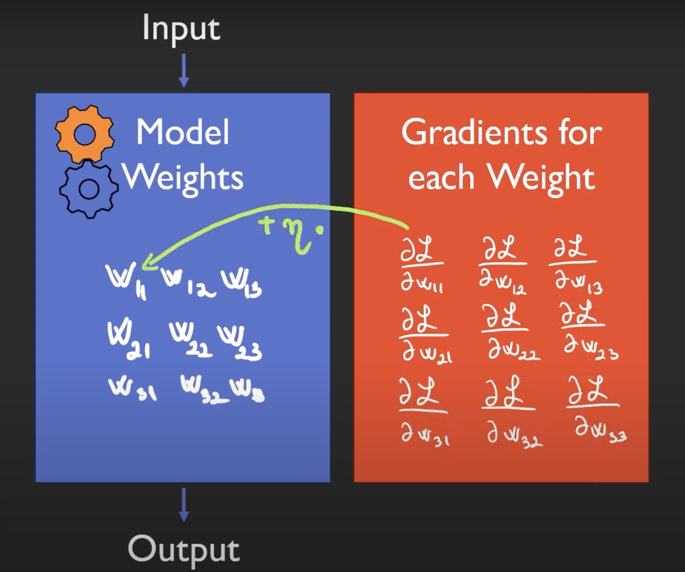

https://www.youtube.com/watch?v=KEv-F5UkhxU

---
#### LoRA fintuning method


---
$$
W(finetuning) \to W(freeze)+ \nabla W
$$

$$
W \in R^{d \times k} \\
$$

$$
\nabla W = BA \\
$$
$$
A \in R^{d \times r} ,B \in R^{r \times k} \\
$$

---

### Fully fintuning
$$
\max _{\Phi} \sum_{(x, y) \in \mathcal{Z}} \sum_{t=1}^{|y|} \log \left(P_{\Phi}\left(y_t \mid x, y_{<t}\right)\right)
$$

## LoRA
$$
\max _{\Theta} \sum_{(x, y) \in \mathcal{Z}} \sum_{t=1}^{|y|} \log \left(P_{\Theta_0+\Delta \Phi(\Theta)}\left(y_t \mid x, y_{<t}\right)\right)
$$

- $\Delta \Phi=\Delta \Phi(\Theta)$ : the task-specific parameter increment
- 훨씬 작은 set of parameters $\Theta$ s.t $\Theta \ll\left|\Phi_0\right|$


fintunig으로 점점커지는 LLM을 감당하기 힘들기에, 그걸 효율적으로 파인튜닝 시키는 방법.

---

### what is Rank?


- numbers how many linearly independent columns in matrix. = rank of columns = rank of rows

- rank :  row reduced echelon form의 1의 개수

#### rref
elementary matrix를 곱해서 만들수있음.

---
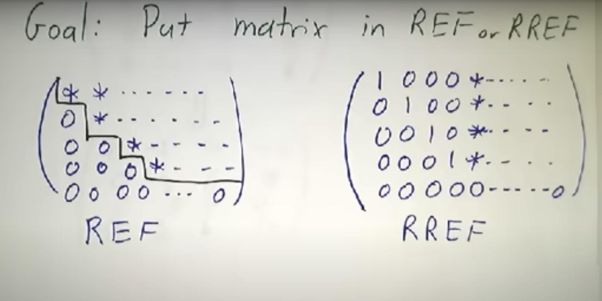

---

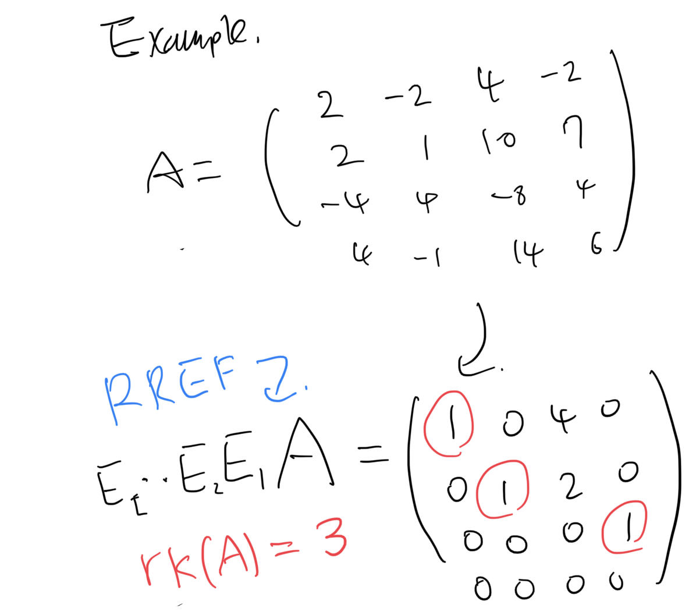

---


$A \sim_{r} B$
$A \sim_{r} C$
$B=C$

rref의 유일성과 존재성 증명됨.

---
#### LoRA
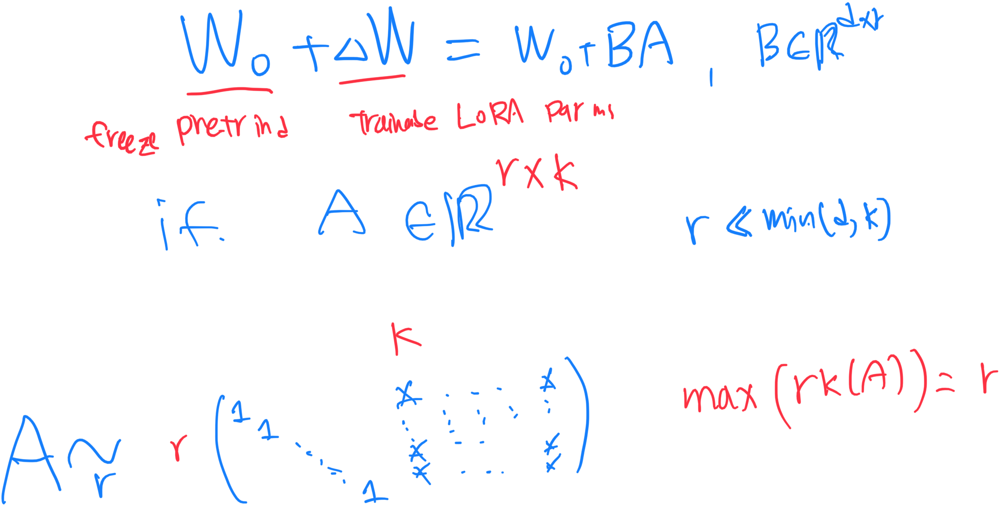

---
only adapting the attention weights

$W_q,W_k,W_v,W_o$

freeze MLP modules

---
## Alternatives

1. adding Adapter Layer in  each transformer block 

2. Prefix tuning

### reference
youtube channels : 딥러닝논문읽기모임

https://www.youtube.com/watch?v=BJqwmDpa0wM


---

1. adding Adapter Layer in  each transformer block 
   
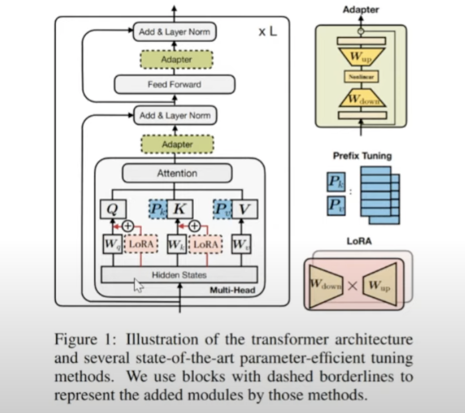

inference latency 발생 


---

1. Prefix tuning

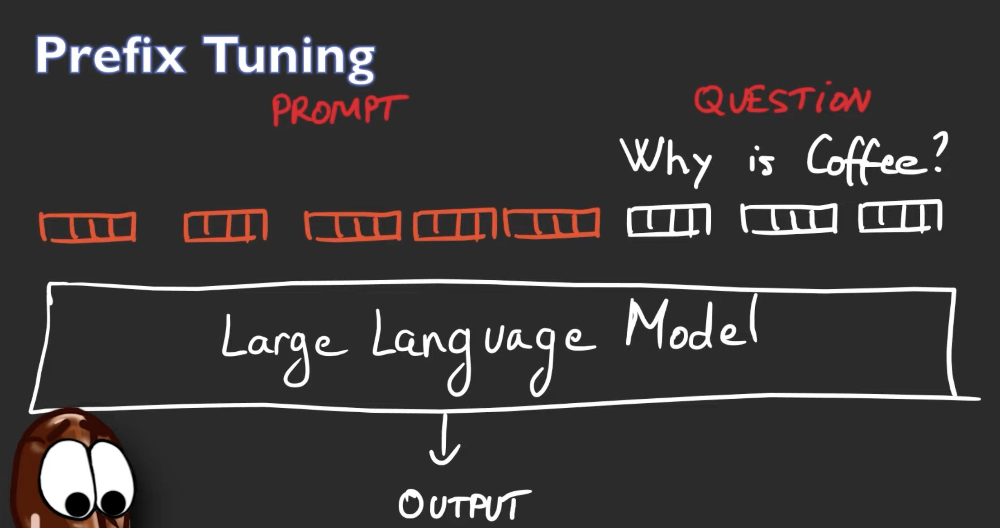
https://www.youtube.com/watch?v=KEv-F5UkhxU

---
# LoRA

원래 weight에 $BA$를 통해서 weight_0에서 variants를 가하겠다.

---
# CODE

https://github.com/microsoft/LoRA

---

#### A,B Definition

```python

class Linear(nn.Linear, LoRALayer):
    # LoRA implemented in a dense layer

        # Actual trainable parameters
    
    ###########################################################
    ################   Definition !!!!!   #####################
        if r > 0:
            self.lora_A = nn.Parameter(self.weight.new_zeros((r, in_features)))
            self.lora_B = nn.Parameter(self.weight.new_zeros((out_features, r)))
            self.scaling = self.lora_alpha / self.r
            # Freezing the pre-trained weight matrix
            self.weight.requires_grad = False
        self.reset_parameters()
        if fan_in_fan_out:
            self.weight.data = self.weight.data.transpose(0, 1)

```
---

#### A,B initalize

```python
def reset_parameters(self):
    self.conv.reset_parameters()
    if hasattr(self, 'lora_A'):
        # initialize A the same way as the default for nn.Linear and B to zero
        nn.init.kaiming_uniform_(self.lora_A, a=math.sqrt(5))
        nn.init.zeros_(self.lora_B)
```

---


```python
    # LoRA implemented in a dense layer
    def reset_parameters(self):
        nn.Embedding.reset_parameters(self)
        if hasattr(self, 'lora_A'):
            # initialize A the same way as the default for nn.Linear and B to zero
            nn.init.zeros_(self.lora_A)
            nn.init.normal_(self.lora_B)

```
---

---
#### elementwise sum
```python

    def train(self, mode: bool = True):
        def T(w):
            return w.transpose(0, 1) if self.fan_in_fan_out else w
        nn.Linear.train(self, mode)
        if mode:
            if self.merge_weights and self.merged:
                # Make sure that the weights are not merged
                if self.r > 0:
                    self.weight.data -= T(self.lora_B @ self.lora_A) * self.scaling
                self.merged = False     

```

---
# Experiments

---

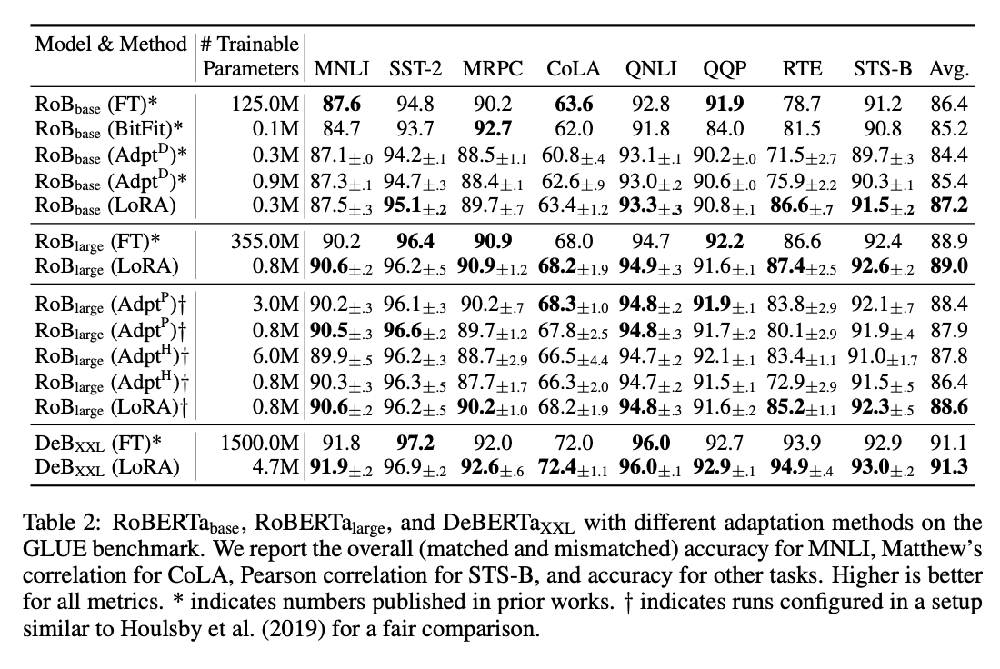

---
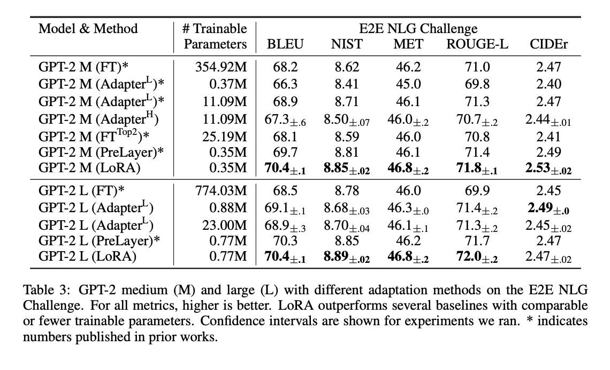

---
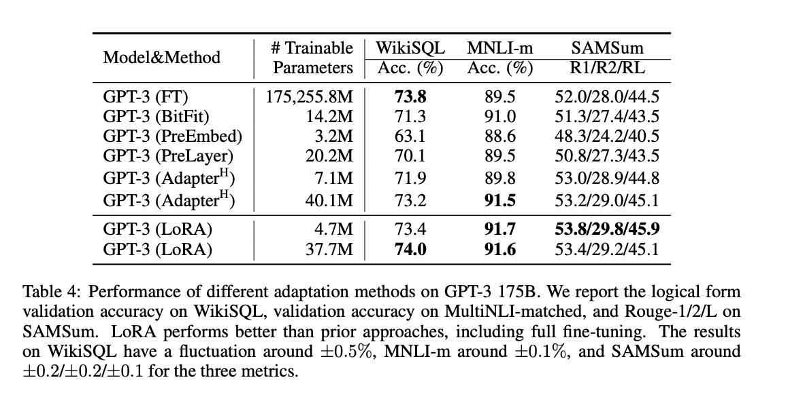

---
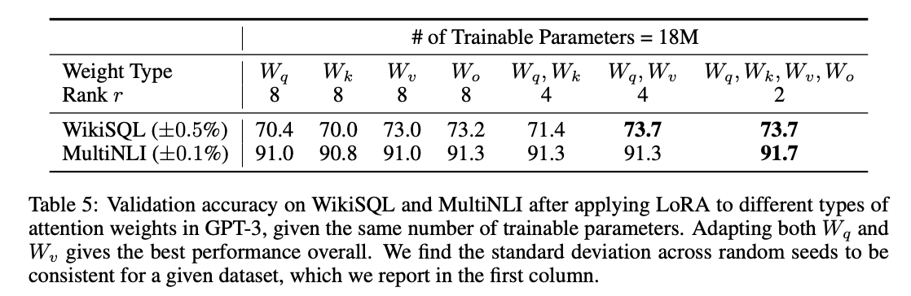

---
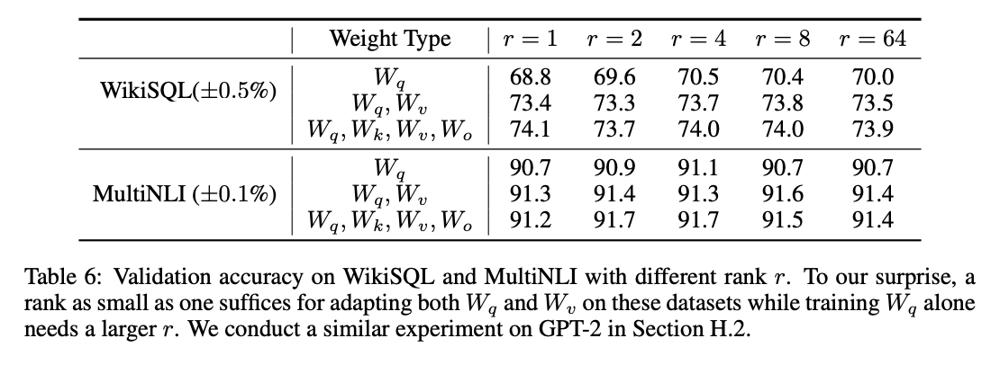

This suggests the update matrix ∆W could have a very small
“intrinsic rank"

---
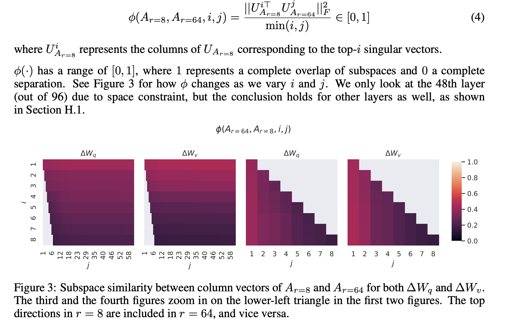

---
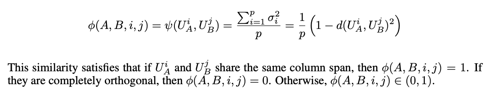
---
## conculusion

Conclusion
- Large-scale language model을 효율적으로 튜닝하는 LORA 제안
- Adapter 류의 기법과 다르게 inference latency가 발생하지 않음
- Prefix-tuning과 다르게 usable sequence length를 줄일 필요가 없음
- 가중치 업데이트 행렬이 low intrinsic rank를 가진다고 가정
- 논문에선 LM에 초점을 맞췄지만 이론적으로 모든 dense layer에 적용가능

---

# END

읽어주셔서 감사합니다.

-Shin joong hyun-