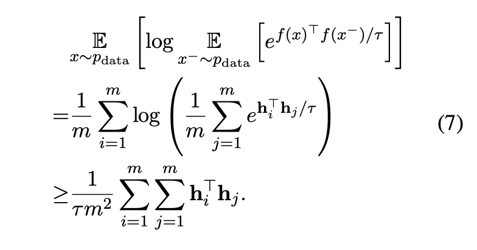

# SimCSE
## "Simple Contrastive Learning of Sentence Embeddings"

### contrastive learning

vision에서는 positive pair를 augmentation을 이용해서 similar한 두 이미지를 minimize하고 다른 사진과의  distance를 멀게해서 학습 시킨다.

---

이처럼 dropout을 이용해서 one sentence를 다른 dropout mask를 적용해서 unsupervised constrastive learning을 하면 다른 기법들보다 적절하게 augmentation이 된다는것이 이 논문의 핵심이다.

이 논문에서 encoder로는 BERT_base, RoBERTa를 사용하였다.

### objective function

분자 부분은 positive pair 끼리 aligment를 맞추고, 분모 부분은 negative pair들의 임베딩 벡터의 Anisotropy를 조절한다. language representation에서 anisotropy problem이 주요하다는것을 다른 여러 논문으로 증거를 내세운다.

### Anisotropy

$h_i = f(x_i)$
위 objective function에서 
Jensen’s inequality를 적용하면, 아래와 같이 된다.

## Problem1

$f(x_i)$가 concave, convex임에 따라 부등호 방향이 달라지는데 그 판별식을 어떻게 사용했는지 궁금하다. 그리고 완전한 convex function이 아니라 non convex일 텐데 그 오차를 어떻게 계산했는지 궁금하였다.

## Problem2

$$
Sum(WW^T) = \sum_{i=1}^m \sum_{j=1}^m h_i^T h_j
$$
를 $WW^T$의 eigen value의 upper bound이기에, 위 텀을 minimize시키면서 maximum eigen value를 줄이고, the singular spectrum of the embedding space를 “flatten” 시킨다.

 uniformity of sentence embeddings를 향상 시킬수 있다고 하는데, $h_i, h_j$를 각 $x_k
\in R^d$에 평균을 빼야 covariance matrix를 의미하고, 각 분산을 의미하지 않나해서 궁금증이생겼다. 왜냐하면, $h$를 만드는 $f()$는 모르지만, 전체적으로 평균이 커지는것을 줄이는것만해도 이걸 컨트롤 할 수 있고, 분산과의 의미는 멀어지기 때문.

위 내용을 수식으로 표현하는것은 관련 내용들을 학습해서 알게되면 올리겠습니다.

---
### Reference

- https://builtin.com/data-science/symmetric-matrix
- https://en.wikipedia.org/wiki/Jensen%27s_inequality
- https://en.wikipedia.org/wiki/Covariance_matrix

