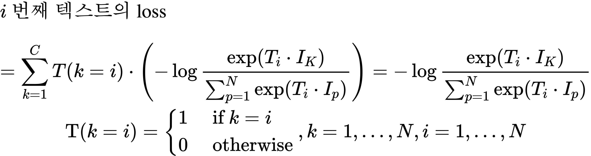
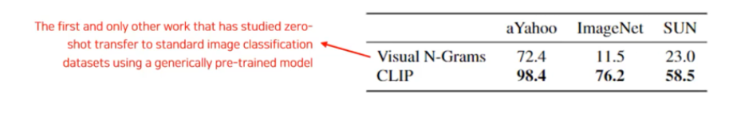
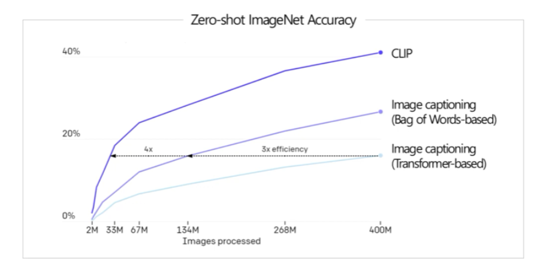
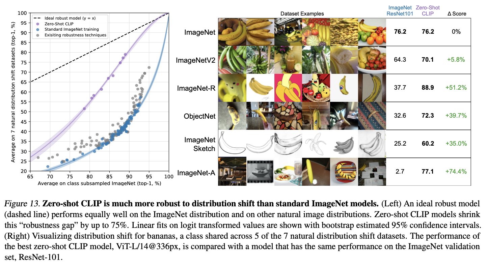

# CLIP 
*- by OpenAI -*
## Abstract
- supervision by language models
- enabling zero-shot transfer of the model to downstream tasks


## Introduction

- efficient image representation via manifold learning
- crucial difference between these weakly supervised models and recent explorations of learning image representations directly from natural language is scale.

## Approach

- idea of natural language supervision
- when using topic model and n-gram representations, improve learning
- no annotations

#### Dataset
- (image : one sentence) pairs from internet
- (image, text) pairs one of a set of 500,000 queries. 
- class balance : maximum of pairs per query = 20,000

<h6 style="color:red">Problem</h6>

>similarity : predict exact word of the text accompanying each image. this is a difficult task dueto the wide variety of text that co-occur with images

## Model 
- Contrastive learning
- starting with the same bag-of-words encoding baseline, swapped the predictive objective for a contrastive objective.

> positive pair = $N$
> negative pair = $N^2 - N$
> 
<h6 style="color:red">Problem</h6>

>how to control pairs of negative and positive? and how to control similar relation like cat and lion?

- **use only a linear projection** between the representation and the contrastive embedding space.

text : only a single sentence.
image : only data augmentation which implement random square crop from resized images.

### Encoding
1. Image Encoding : Batch Image → Image Encoder (Modified Resnet / ViT) → Image Vector 
2. Text Encoding : Batch Text → Text Encoder (Transformer) → Text Vector




### Contrastive Learning
1. Cosine Similarity 계산 : Image Vector와 Text Vector 사이 내적 → Cosine Similarity 계산 
2. 각각의 Loss 계산 : Softmax → N개의 Image, N개의 Text에 해당하는 Loss 계산
3. 최종 Loss 산출


```python
# image_encoder - ResNet or Vision Transformer
# text_encoder  - CBOW or Text Transformer
# I[n, h, w, c] - minibatch of aligned images
# T[n, l]       - minibatch of aligned texts
# W_i[d_i, d_e] - learned proj of image to embed
# W_t[d_t, d_e] - learned proj of text to embed
# t             - learned temperature parameter
# extract feature representations of each modality
I_f = image_encoder(I) #[n, d_i]
T_f = text_encoder(T)  #[n, d_t]
# joint multimodal embedding [n, d_e]
I_e = l2_normalize(np.dot(I_f, W_i), axis=1)
T_e = l2_normalize(np.dot(T_f, W_t), axis=1)
# scaled pairwise cosine similarities [n, n]
logits = np.dot(I_e, T_e.T) * np.exp(t)
# symmetric loss function
labels = np.arange(n)
loss_i = cross_entropy_loss(logits, labels, axis=0)
loss_t = cross_entropy_loss(logits, labels, axis=1)
loss   = (loss_i + loss_t)/2
```

$i$ 번째 텍스트의 loss
$$
\begin{gathered}
=\sum_{k=1}^C T(k=i) \cdot\left(-\log \frac{\exp \left(T_i \cdot I_K\right)}{\sum_{p=1}^N \exp \left(T_i \cdot I_p\right)}\right)=-\log \frac{\exp \left(T_i \cdot I_K\right)}{\sum_{p=1}^N \exp \left(T_i \cdot I_p\right)} \\
\mathrm{T}(k=i)=\left\{\begin{array}{ll}
1 & \text { if } k=i \\
0 & \text { otherwise }
\end{array}, k=1, \ldots, N, i=1, \ldots, N\right.
\end{gathered}
$$

$i$ 번째 이미지의 loss
$$
=\sum_{k=1}^C I(k=i) \cdot\left(-\log \frac{\exp \left(I_i \cdot T_K\right)}{\sum_{p=1}^N \exp \left(I_i \cdot T_p\right)}\right)=-\log \frac{\exp \left(I_i \cdot T_K\right)}{\sum_{p=1}^N \exp \left(I_i \cdot T_p\right)}
$$
$i$ 번째 텍스트의 loss
$$
=\sum_{k=1}^C T(k=i) \cdot\left(-\log \frac{\exp \left(T_i \cdot I_K\right)}{\sum_{p=1}^N \exp \left(T_i \cdot I_p\right)}\right)=-\log \frac{\exp \left(T_i \cdot I_K\right)}{\sum_{p=1}^N \exp \left(T_i \cdot I_p\right)}
$$
최종 loss = ( $N$개의 이미지의 loss + $N$개의 텍스트 loss) /2

## Experiment results

1. Zero Shot CLIP vs Visual N-Grams


2. Zero Shot CLIP vs Zero Shot Image Captioning
성능/효율성 : CLIP > BOW based Image Captioning > Transformer based Image Captioning



3. Robust on Natural Distribution Shift
높은 강건성



### summary

1. Idea : 이미지-텍스트 Pair 학습 → 이미지의 의미론적 정보 학습 → 학습하지 않았던 이미지에 대한 예측 가능 높은 일반화 성능
낮은 레이블링 비용
높은 강건성
2. Dataset : 대량의 크롤링 이미지-텍스트 Pair 
3. Contrastive Learning