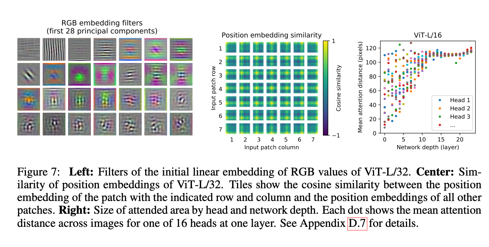
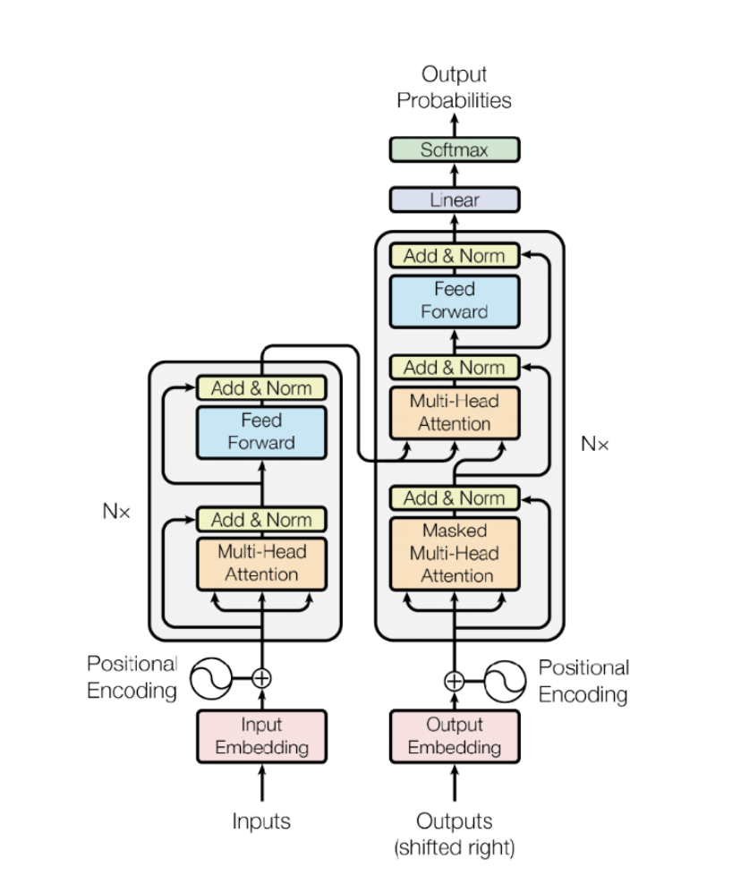

### "AN IMAGE IS WORTH 16X16 WORDS: TRANSFORMERS FOR IMAGE RECOGNITION AT SCALE
"

The ViT architecture consists of a stack of Transformer layers, where the input image is divided into patches, which are then flattened and fed into the Transformer layers. The ViT also employs a technique called positional encoding to provide the model with information about the spatial relationships between the patches.

## abstract 

CNN 대신 self-attention layer만을 이용해서 sota모델을 만들었다.

CNN은 내재하고있는 inductive bias 가 부족하다.

translation equivariance and locality, and therefore do not generalize well when trained on insufficient amounts of data.

Q : 포지셔널 인코딩 궁금

$$ 
x \in R^{H \times W \times C}
$$
$$
x_p \in R^{N \times (P^2 \times C)}
$$
$ N = H*W / P^2 $

Q : 채널 개수만큼, 겹치는것 정보가 조금씩 겹칠것 같다. 왜냐하면, 적색, 녹색, 파란색 색정보가 뚜렷하지않으면 비슷비슷한거 아닌가..? 모르겠다.

#### positional encoding

