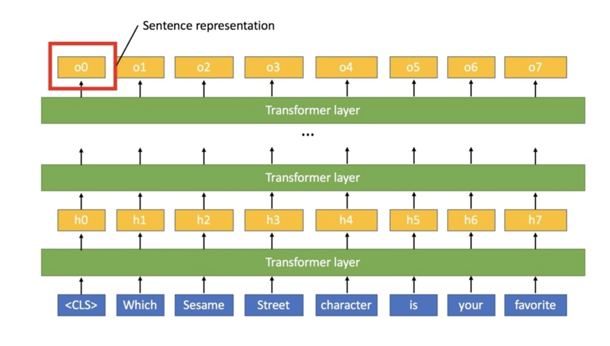

# Vision Transformer 

## Abstract

- CNN 대신 self-attention layer만을 이용해서 sota모델을 달성

- CNN은 내재하고있는 inductive bias 가 부족하다.

>#### Inductive bias
>특정 데이터에 대해 좋은 성능을 내기 위해 모델에 가하는 prior 가정.
>
>Image data : local한 정보를 추출하는것이 중요. - convolution filter : 2d information 유지
>
>Time series data : sequential 한 정보 추출 
>
>반면에 transformer 는 1차원 정보로 만들기 때문에, 2차원 local한 정보 유지 못함.
>
>ViT가 CNN보다 이미지별 inductive bias가 훨씬 적다는 것에 주목합니다. ViT에서는 MLP 계층만 Local 및 translationally equivariant하고, self-attention layer는 global합니다. 초기화 시 위치 임베딩은 패치의 2D 위치에 대한 정보를 전달하지 않으며 패치 간의 모든 공간 관계는 처음부터 학습해야 합니다.

## Introduction

- Transformer 구조의 NLP task에서의 성공
- computational efficiency & scalability
- datasets, model size $\propto$ performance

>Q : why transformer has computational efficiency and scalability?

## Method

### Definition

images : $x \in R^{H \times W \times C}$ in here , 224x224x3[ ImageNet Datasets ]

=> Sequence of flattened 2D patches $x_p \in R^{N \times ( P^2 \times C)}$ 

>Q : 채널 개수만큼, 겹치는것 정보가 조금씩 겹칠것 같다. 왜냐하면, 적색, 녹색, 파란색 색정보가 뚜렷하지않으면 비슷비슷한거 아닌가..? 

=> Latent Vector size : $D$

### Transformer vs ViT

>#### Class token
>
>similar with **BERT**'s cls token
>
>$z_0^0 =  x_{class}$ and $z_L^0$ serves as image representation $y$
>
>전체 이미지에 대한 임베딩 $y$를 MLP에 통과시켜 이미지를 분류한다.

>#### Position Embedding
>
>>Q : PE initial weights에 대한 제약조건이 있는지 아니면 random하게 만들었는지.

## Experiments 

## Conclusion

Contribution
- image recognition 분야에 Transformer를 직접적으로 적용한 첫 사례

- 이미지에 특정된 inductive bias를 아키텍처에 주입하지 않음 (이미지 패치 추출 부분 제외)

- 모델 학습 과정 전체적으로 이미지를 NLP에서 사용되던 것처럼 패치 시퀀스로 다룸

- inductive bias가 약하기 때문에 보다 general-purpose의 architecture라고 할 수 있음. (one-for-all)

- 큰 사이즈의 데이터셋에서 사전 학습한 후에 기존의 CNN 기반 baseline보다 더 좋은 성능. 추가적으로, 사전학습이 그리 어렵지 않다는 점.
 

### Appendix

##### about Cls token

##### QNA. BERT에서 왜 CLS Token이 Sentence representation을 담게되는가?
1. 일단, 어떤 Sequence data를 Single vector로 변환하는 방법에는 당연히 여러 방법이 있다. Max/Mean pooling, Attention, ETC, ... 하지만 BERT 저자들은 가장 간단한 방법을 채택했는데, 그게 바로 First token(=CLS)에 대한 Vector를 가져오는 방법이다.

2. 어떻게 그걸로 퉁칠 수 있는가? -> 일단, 각 Token에 대한 Embedding vector가 추출되는 과정은 아래 그림과 같은데, Transformer를 썼으니까 사실 당연하게도 모든 Embedding token들은 다른 Token들에 영향을 받고 받고 받아 구성된다. 다만 Which는 Which를 보존하게, Sesame은 Sesame을 보존하게 살아나는 것 뿐인데, <CLS>는 첫째로, 모든 Input에서, 항상 0-Position에 위치한 Token이다. 이것의 의미는 BERT의 Embedding vector는 단순한 Token embd로 구성되는게 아니라, Token embd + Segment embd + Position embd로 구성되는데, 다른 의미를 가진 단어들은 3개가 모두 다른 반면, <CLS>는 다른 Token의 정보를 주고받으면서 구성되면서도, Segment embd, Position embd가 항상 동일하다. 둘째로, <CLS>는 Word로써의 의미가 없다. 즉, 기존 공간에서 CLS의 권위는 사실 Blank에 가깝다. 이런 놈한테 거듭된 Transformer로 다른 Tokens에 대한 정보가 인코딩한다는 것은, 전체 Sentence에 대한 정보를 넘긴다는 의미가 되며, 따라서 CLS repr는 Sentence repr로써 활용할 수 있게 된다.

# reference 
- https://daebaq27.tistory.com/108
- https://web.eecs.umich.edu/~justincj/slides/eecs498/WI2022/598_WI2022_lecture18.pdf
- https://www.youtube.com/watch?v=bgsYOGhpxDc