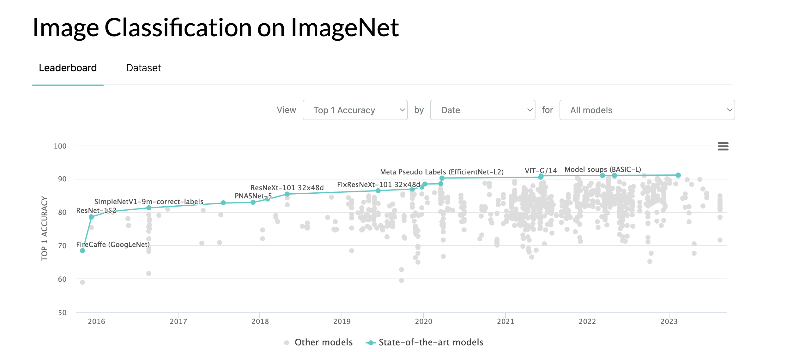
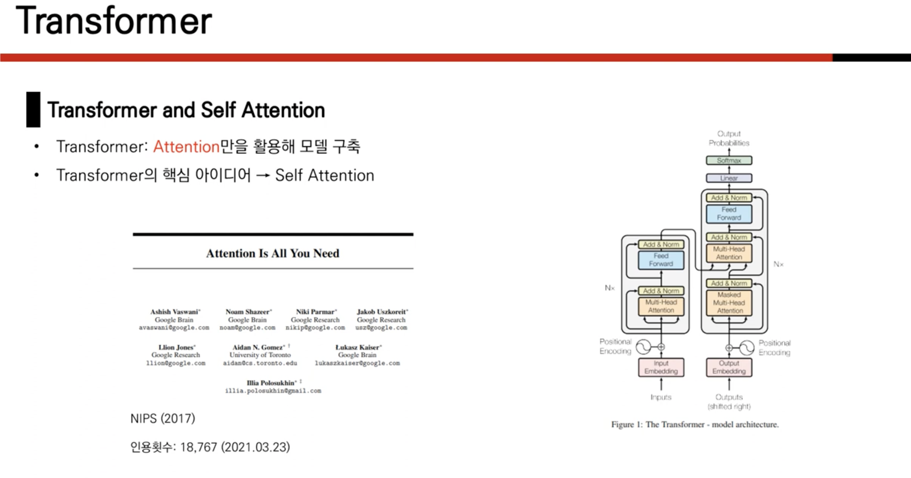
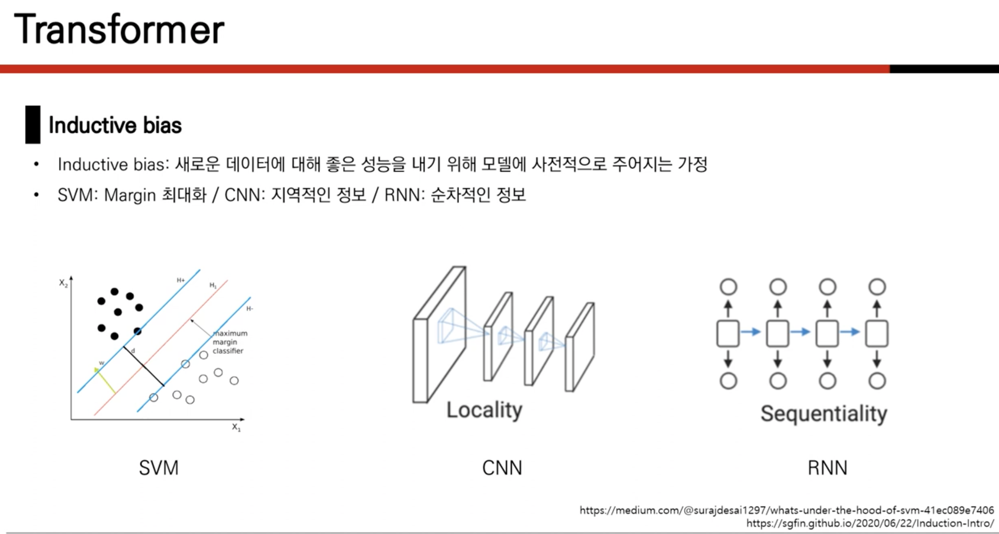
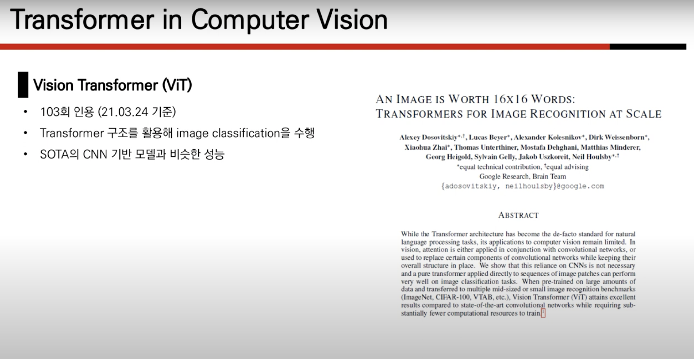

## AN IMAGE IS WORTH 16X16 WORDS: TRANSFORMERS FOR IMAGE RECOGNITION AT SCALE

Alexey Dosovitskiy∗,†, Lucas Beyer∗, Alexander Kolesnikov∗, Dirk Weissenborn∗, Xiaohua Zhai∗, Thomas Unterthiner, Mostafa Dehghani, Matthias Minderer,
Georg Heigold, Sylvain Gelly, Jakob Uszkoreit, Neil Houlsby∗,† ∗equal technical contribution, †equal advising

Google Research, Brain Team {adosovitskiy, neilhoulsby}@google.com

## abstract 

The ViT architecture consists of a stack of Transformer layers, where the input image is divided into patches, which are then flattened and fed into the Transformer layers. The ViT also employs a technique called positional encoding to provide the model with information about the spatial relationships between the patches.

CNN 대신 self-attention layer만을 이용해서 sota모델을 만들었다.

CNN은 내재하고있는 inductive bias 가 부족하다.

translation equivariance and locality, and therefore do not generalize well when trained on insufficient amounts of data.

## introduction

Thanks to Transformers’ computational efficiency and scalability, it has become possible to train models of unprecedented size, with over 100B parameters (Brown et al., 2020; Lepikhin et al., 2020). With the models and datasets growing, there is still no sign of saturating performance.

- Transformer 구조의 NLP task에서의 성공
- computational efficiency & scalability
- datasets, model size $\propto$
>Q : why transformer has computational efficiency and scalability?

## inductive bias 

특정 데이터에 대해 좋은 성능을 내기 위해 모델에 가하는 prior 가정.

EX) CNN : local한 정보를 추출하는것이 중요. - convolution filter : 2d information 유지

RNN : sequential 한 정보 추출 - rnn

---
반면에 transformer 는 1차원 정보로 만들기 때문에, 2차원 local한 정보 유지 못하.

