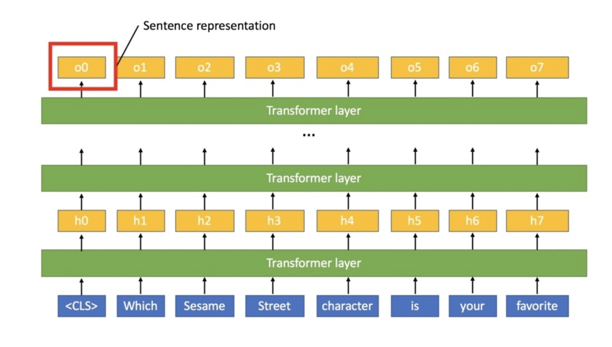

## class token
-bert의 cls token 거의 동일

image classification 같은 경우는
patch 정보가 아닌 image 전체애 대한 임베딩이 필요

따라서 cls token을 사용. 

---

##### QNA. BERT에서 왜 CLS Token이 Sentence representation을 담게되는가?
1. 일단, 어떤 Sequence data를 Single vector로 변환하는 방법에는 당연히 여러 방법이 있다. Max/Mean pooling, Attention, ETC, ... 하지만 BERT 저자들은 가장 간단한 방법을 채택했는데, 그게 바로 First token(=CLS)에 대한 Vector를 가져오는 방법이다.

2. 어떻게 그걸로 퉁칠 수 있는가? -> 일단, 각 Token에 대한 Embedding vector가 추출되는 과정은 아래 그림과 같은데, Transformer를 썼으니까 사실 당연하게도 모든 Embedding token들은 다른 Token들에 영향을 받고 받고 받아 구성된다. 다만 Which는 Which를 보존하게, Sesame은 Sesame을 보존하게 살아나는 것 뿐인데, <CLS>는 첫째로, 모든 Input에서, 항상 0-Position에 위치한 Token이다. 이것의 의미는 BERT의 Embedding vector는 단순한 Token embd로 구성되는게 아니라, Token embd + Segment embd + Position embd로 구성되는데, 다른 의미를 가진 단어들은 3개가 모두 다른 반면, <CLS>는 다른 Token의 정보를 주고받으면서 구성되면서도, Segment embd, Position embd가 항상 동일하다. 둘째로, <CLS>는 Word로써의 의미가 없다. 즉, 기존 공간에서 CLS의 권위는 사실 Blank에 가깝다. 이런 놈한테 거듭된 Transformer로 다른 Tokens에 대한 정보가 인코딩한다는 것은, 전체 Sentence에 대한 정보를 넘긴다는 의미가 되며, 따라서 CLS repr는 Sentence repr로써 활용할 수 있게 된다.

