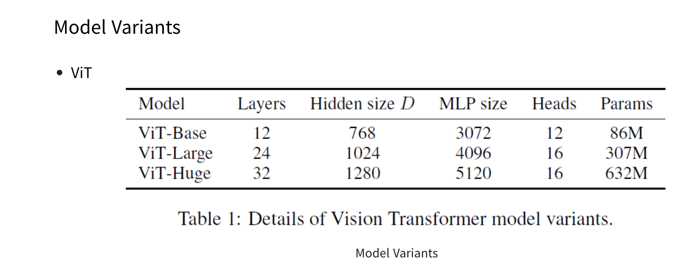
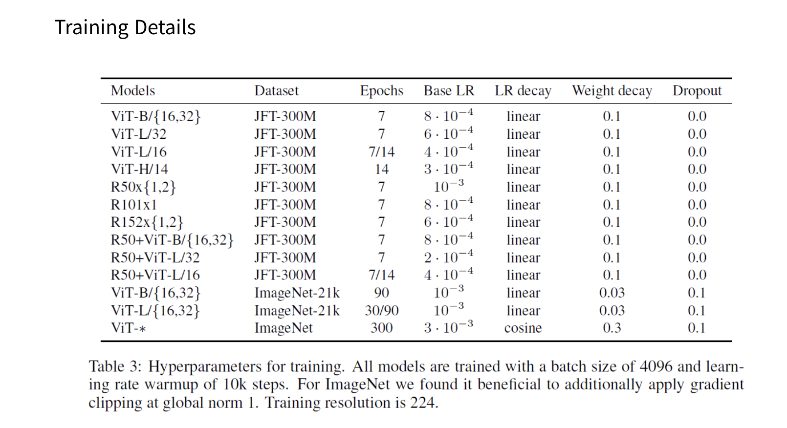
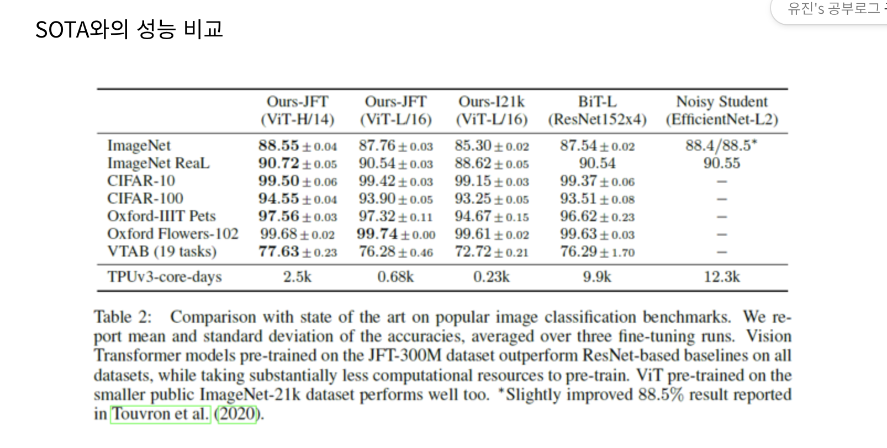
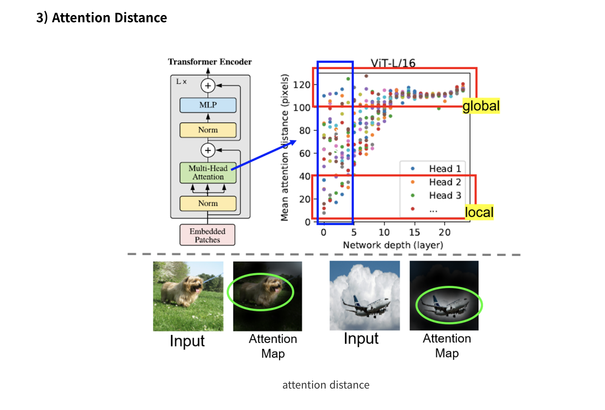
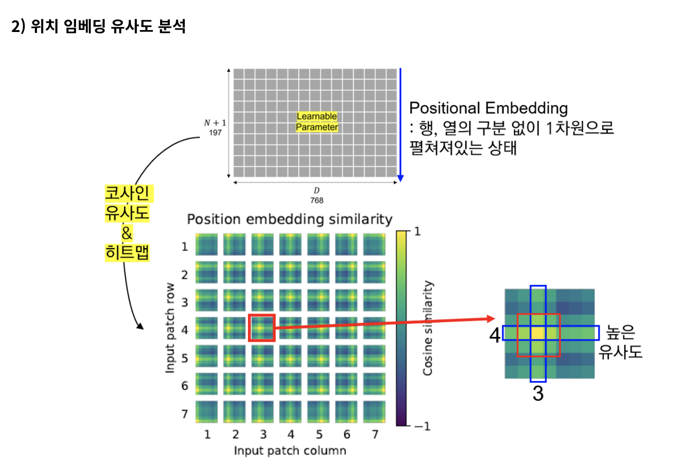
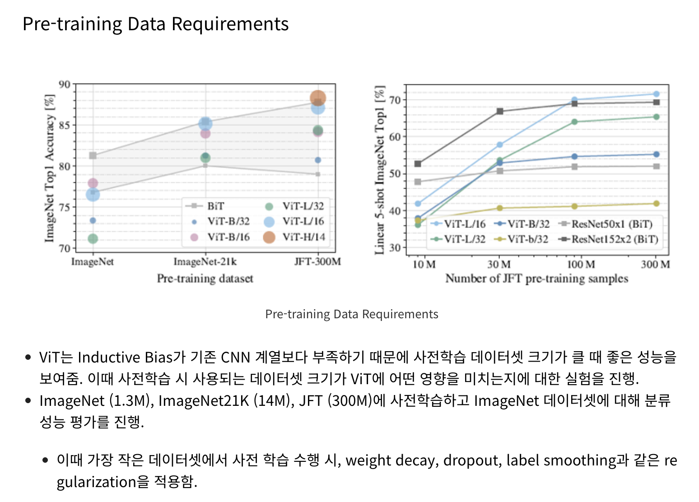

이는 ViT에서 1차원 임베딩을 사용했음에도 불구하고, 내부적으로 2차원의 이미지 위상을 잘 파악하고 있음을 알 수 있다. 즉, 1차원 위치 임베딩만으로도 2차원 이미지를 표현하기에 충분함을 시사함.

행렬의 각 요소는 i번째 패치 행, j번째 패치 열에 대한 코사인 유사도 값의 히트맵으로 구성되어 있음.

위치 임베딩의 i번째 열, j번째 행 값이 이웃한 열, 행의 임베딩 값과 높은 유사도를 보임을 알 수 있음. 즉, 가까운 패치일 수록 높은 유사도를 보여줌. 또한, 상대적으로 같은 열 & 같은 행의 위치 임베딩 값과 높은 유사도.

Attention Distance는 CNNs의 Receptive Field와 유사한 개념으로 볼 수 있음을 알고 넘어가자.

Self-Attention은 네트워크가 가장 첫번째 레이어에서도 이미지 전체적인(global) 특성을 파악할 수 있도록 함.
이를 확인하기 위해 Attention weights를 바탕으로 Mean Attention Distance를 계산하여 한 픽셀에서 어느 정도 떨어져있는 픽셀까지 주목(attend)하는지 실험을 통해 보여줌.

5. Conclusion
Contribution
image recognition 분야에 Transformer를 직접적으로 적용한 첫 사례
간단하면서 높은 확장성을 가진 Transformer 구조를 성공적으로 Image Recognition에 적용
이미지에 특정된 inductive bias를 아키텍처에 주입하지 않음 (이미지 패치 추출 부분 제외)
모델 학습 과정 전체적으로 이미지를 NLP에서 사용되던 것처럼 패치 시퀀스로 다룸
inductive bias가 약하기 때문에 보다 general-purpose의 architecture라고 할 수 있음. (one-for-all)
큰 사이즈의 데이터셋에서 사전 학습한 후에 기존의 CNN 기반 baseline보다 더 좋은 성능. 추가적으로, 사전학습이 그리 어렵지 않다는 점.
 
Challenges
본 연구에서는 classification task에만 적용하였기에 segmentation, detection 등의 다른 computer vision task에도 적용이 성공적으로 되는지는 아직 정확히 알 수 없음.
사전학습 시, self-supervised learning 방법론을 성공적으로 적용시킬 방안을 탐색해야 함.
self-supervised learning 방식으로 사전학습을 해서 나쁘지 않은 결과를 얻었지만 large-scale supervised pre-training과는 큰 차이가 있었음.
모델 구조 개선을 통한 모델 성능 향상의 여지가 존재함.

# reference 
- https://daebaq27.tistory.com/108
- https://web.eecs.umich.edu/~justincj/slides/eecs498/WI2022/598_WI2022_lecture18.pdf

