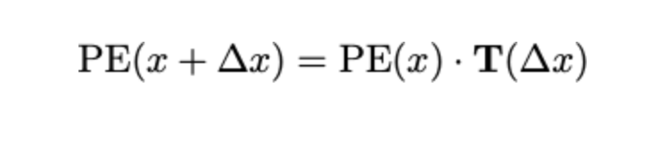
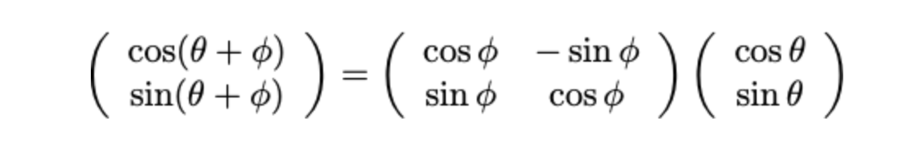
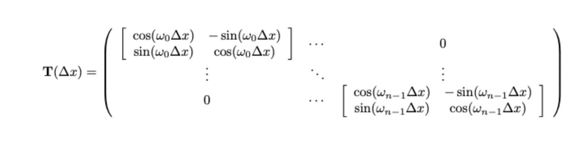

Each row-vector represents the positional encoding vector of a single, discrete position. The positional encoding matrix PE, is a vector of these vectors, and so it is a (seq_len, n) dimensional matrix (seq_len is the sequence length). We now want to find a linear transformation T(dx) such that the following equation holds:

How will we do this? First, notice that since all of the elements of PE are sines, the positions x are actually angles. From trigonometry, we know that any operation T that shifts the argument of a trig function must be some kind of rotation. Rotations can famously be applied by applying a linear transformation to a (cosine, sine) pair. Using the standard results for rotation matrices, we can make use of the following identity:

Q : PE initial weights에 대한 제약조건이 있는지 아니면 random하게 만들었는지.